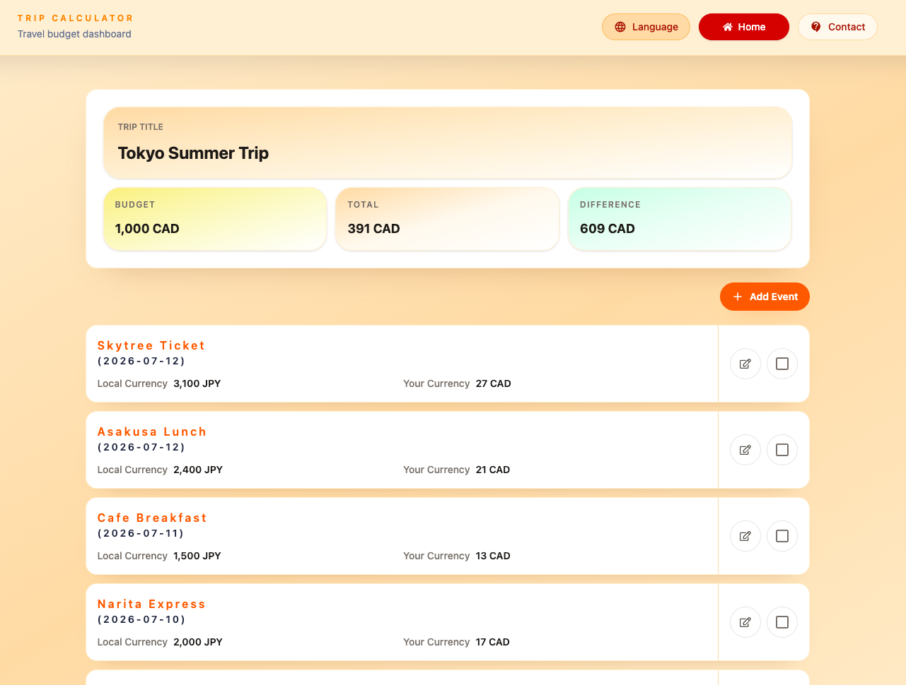
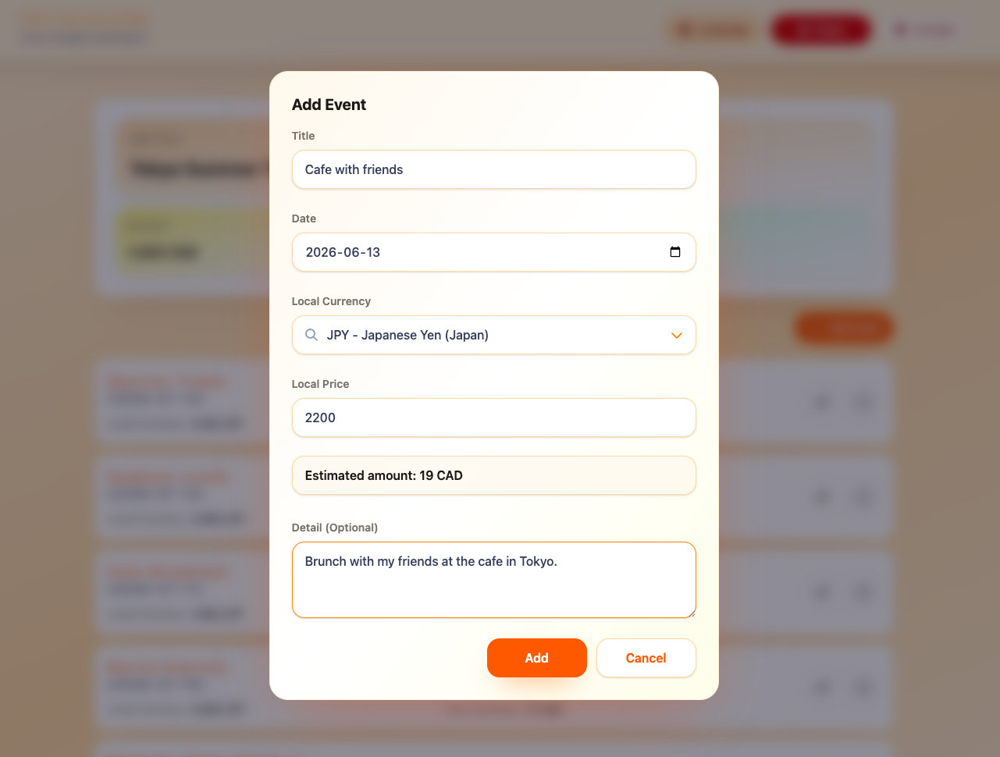

  

<h1 align="center">Trip Calculator</h1>

Track travel budgets, record local spending, and convert expenses into your home currency.

<h2>Tech Stack</h2>
<strong>React</strong> ·
<strong>TypeScript</strong> ·
<strong>Vite</strong> ·
<strong>Tailwind CSS</strong> ·
<strong>React Router</strong> ·
<strong>React Hook Form</strong> ·
<strong>Zod</strong> ·
<strong>i18next</strong> ·
<strong>Node.js</strong> ·
<strong>Express</strong> ·
<strong>Prisma</strong> ·
<strong>PostgreSQL</strong> ·
<strong>Supabase</strong> ·
<strong>JWT Auth</strong>

<h2>Screenshots</h2>
  
  

<h2>Overview</h2>

Trip Calculator is a full-stack travel budget app for tracking trip expenses in local currencies and converting them into the user's home currency.

<h2>Features</h2>
<ul>
  <li>Sign up, log in, and protected routes</li>
  <li>Trip CRUD with budget, date, and home currency</li>
  <li>Expense event CRUD with local currency input</li>
  <li>Budget summary with total spent and difference</li>
  <li>Exchange rate preview before saving a new expense</li>
  <li>Backend exchange-rate caching and stored applied rates</li>
  <li>English, Japanese, and French support</li>
  <li>Responsive UI, contact page, and account deletion</li>
</ul>

<h2>Highlights</h2>
<ul>
  <li>React, TypeScript, Vite, and Tailwind CSS frontend</li>
  <li>React Hook Form and Zod for form and input validation</li>
  <li>Node.js and Express REST API with JWT and cookie-based auth</li>
  <li>Prisma + PostgreSQL schema design with Supabase as the database provider</li>
  <li>External exchange-rate API integration with backend-side caching</li>
  <li>i18next, bcrypt, zxcvbn, CORS, and Prisma seed data</li>
</ul>

<h2>Project Status</h2>

In active development as a portfolio-focused full-stack web application.

<a href="https://trip-calculator-jrio.onrender.com">https://trip-calculator-jrio.onrender.com</a>

<h2>Future Improvements</h2>
<ul>
  <li>Password reset flow</li>
  <li>Google authentication</li>
  <li>Docker-based development setup</li>
  <li>TanStack Query integration for server state management</li>
</ul>
